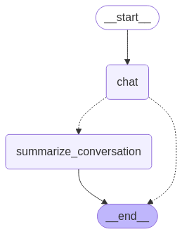

# AI Assistant Chat Application

A powerful, memory-enabled chat assistant built with Streamlit, LangGraph, and LangChain. This application provides a user-friendly interface for conversing with an AI assistant that can remember conversation history, summarize past interactions, and maintain multiple chat sessions.

## Features

- 💬 **Persistent Chat Sessions**: Create and switch between multiple chat threads
- 🧠 **Conversation Memory**: Assistant remembers previous interactions even after summarization
- 📝 **Automatic Summarization**: Long conversations are automatically summarized to maintain context
- 🏷️ **Smart Titling**: Chat sessions are automatically titled based on conversation content
- 📊 **Checkpoint System**: All conversations are saved using LangGraph's checkpoint system

## Installation

### Prerequisites

- Python 3.12+

### Setup

1. Clone the repository:
   ```bash
   git clone https://github.com/yourusername/streamlit-memory-assistant.git
   cd streamlit-memory-assistant
   ```

2. Create and activate a virtual environment:
   ```bash
   # On macOS/Linux:
   python3 -m venv venv
   source venv/bin/activate  

   # On Windows:
   python -m venv venv
   venv\Scripts\activate
   ```

3. Install dependencies:
   ```bash
   pip install -r requirements.txt
   ```

4. Create a `.env` file with your API keys:
   ```
   OPENAI_API_KEY=your_openai_api_key_here
   LANGCHAIN_API_KEY=your_langchain_api_key_here
   ```

## Usage

Run the application:

```bash
streamlit run app.py
```

## Architecture

The application uses LangGraph to manage conversation flow and state. Below is the graph representation of the conversation flow:



The graph shows the main conversation flow:
- Starting at `__start__`
- Moving to the main `chat` node for conversation
- When needed, branching to `summarize_conversation` to maintain context
- Eventually reaching `__end__` when the conversation is complete

## Contributing

Contributions are welcome! Please open an issue or submit a pull request.
